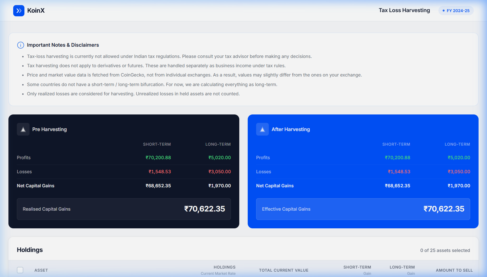
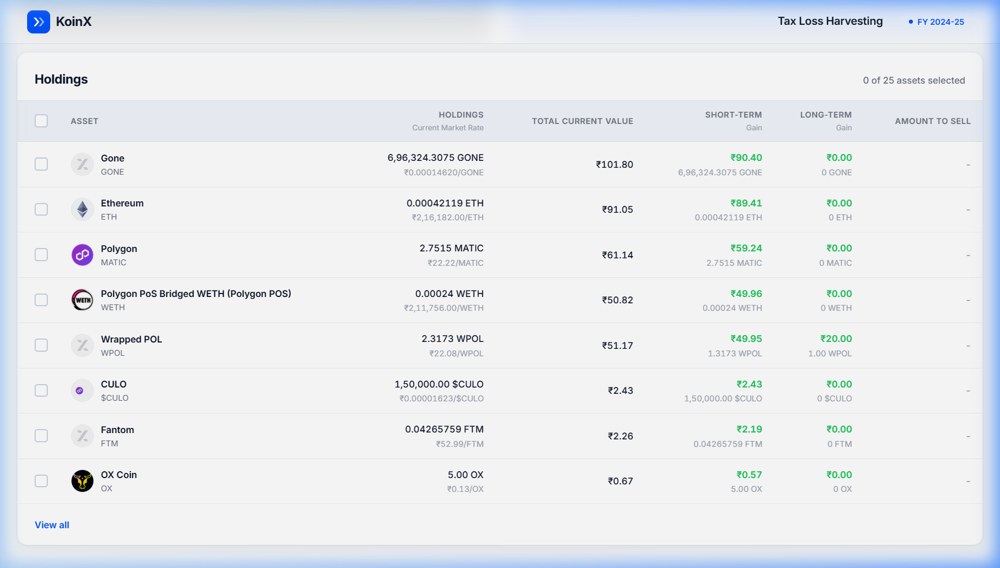
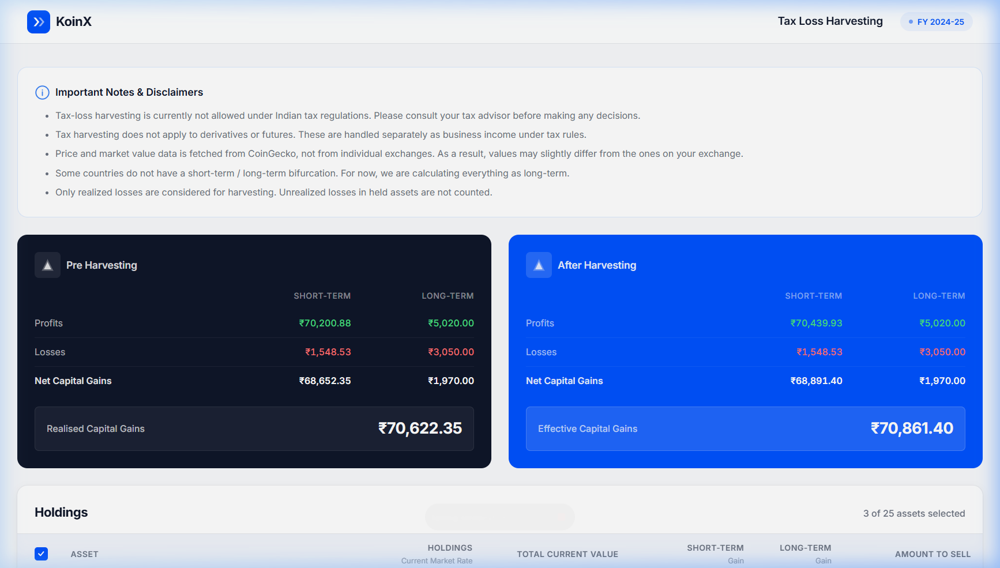
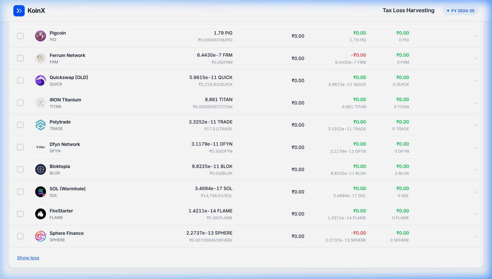

# KoinX - Tax Loss Harvesting Tool

A React app that helps users visualize and optimize their crypto tax strategy through tax loss harvesting. Built for the KoinX Frontend Intern Assignment.

## Live Demo

[https://koinx-tan.vercel.app](https://koinx-tan.vercel.app)

## Screenshots

### Initial State


### Holdings Table


### After Selections


### View All Expanded


## Tech Stack

- React 18
- Vite
- Vanilla CSS
- Context API for state management

## How It Works

The app shows two cards — Pre Harvesting and After Harvesting.

- **Pre Harvesting** shows current capital gains from the API
- **After Harvesting** updates dynamically when you select holdings from the table
- Savings are calculated as the difference between pre and after harvesting gains

### Formulas

- Net STCG = stcg.profits - stcg.losses
- Net LTCG = ltcg.profits - ltcg.losses
- Realised Capital Gains = Net STCG + Net LTCG
- Savings = Pre Harvesting Gains - After Harvesting Gains (only if positive)

When you select a holding:
- If `stcg.gain > 0` → added to STCG profits
- If `stcg.gain < 0` → absolute value added to STCG losses
- Same logic for LTCG

## Setup

```bash
git clone https://github.com/Bhavya1352/KOINX.git
cd KOINX
npm install
npm run dev
```

Opens at `http://localhost:5173/`

## Folder Structure

```
src/
├── api/          # mock API and data
├── components/   # Header, CapitalGainsCards, HoldingsTable, Disclaimer, Loader
├── context/      # HarvestingContext (global state)
├── utils/        # currency and number formatters
├── App.jsx
└── main.jsx
```

## Notes

- Holdings are sorted by absolute short-term gain (most impactful first)
- Initially shows 8 assets, click "View all" for remaining
- All values in INR with Indian number formatting
- Mock APIs have 600-800ms delay to simulate loading
- The tool shows potential reduction in capital gains, not actual tax
